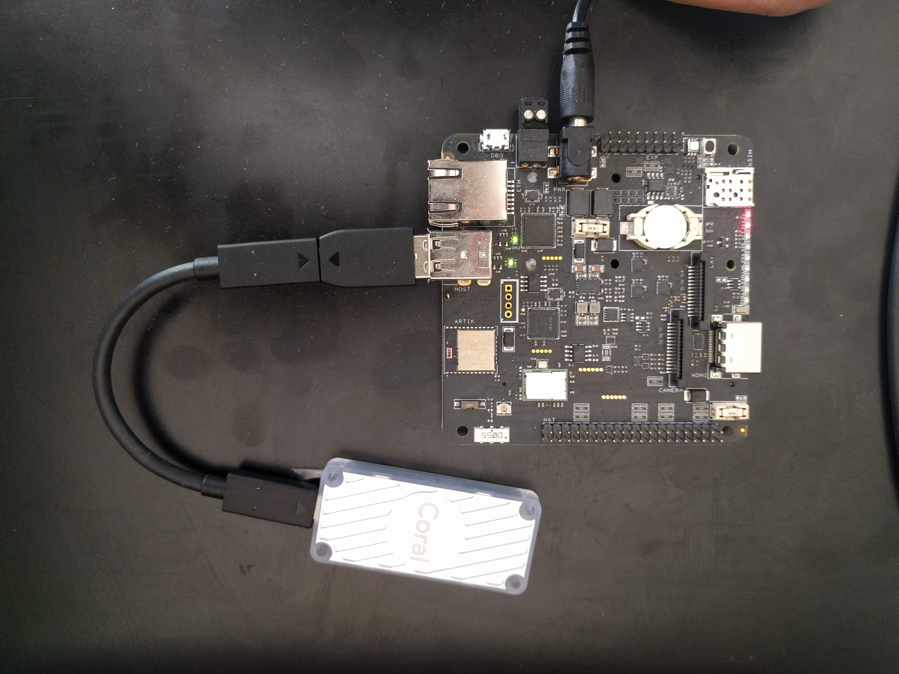
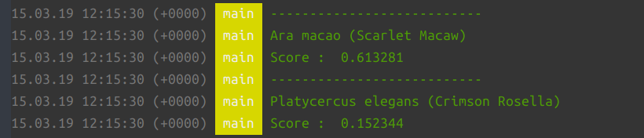

### Edge TPU accelerator with balenaOS

#### Supports 
- [Coral USB accelerator](https://coral.withgoogle.com/products/accelerator/)
- [Coral Dev board ](https://coral.ai/products/dev-board)

This repository provides an example that sets up the TPU accelerator so that it can be used from within a container running on balenaOS.

Looking sharp with the [balenaFin](https://www.balena.io/fin/)

`Dockerfile.template` and `run.sh` have quite a few comments regarding the installation of various libraries the coral usb needs.

#### Some image classification
Output from running one of the example applications that classify an image

#### Some notes:
- libusb is used to communicate with the device.
- The device supports USB 3.0 but the Pi/Fin have USB 2.0 which will be the bottleneck.
- Google's installation script detects the platform and installs the relevant libraries. The platforms detected are only pi3/pi3b+ via the device tree model string. So need to 'tweak' the script a bit to run on the balena Fin
